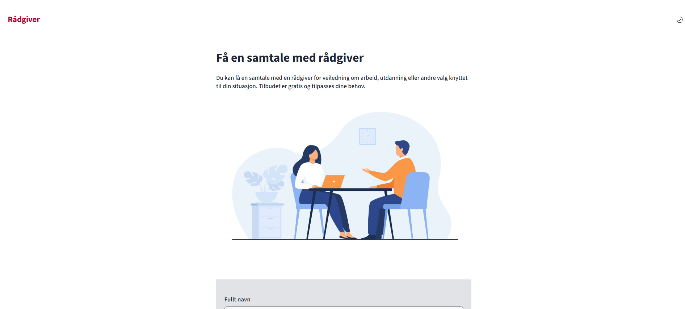

## **Aksel konsultasjon**

Aksel Konsultasjon er en enkel webapplikasjon for å bestille rådgivningstimer. Applikasjonen er utviklet som en øvelse i
å bruke NAV sitt designsystem [Aksel](https://aksel.nav.no/) med [Darkside](https://aksel.nav.no/grunnleggende/darkside/ny-versjon-av-aksel-darkside).



## Teknologier

- React
- TypeScript
- JavaScript
- Less
- Vite
- npm
- ESLint
- Prettier
- Aksel (NAV designsystem) med Darkside

## Forutsetninger

- Node.js (versjon >= 18 anbefales)
- npm

## Hvordan kjøre appen

1. Klon repoet:

```bash
https://github.com/Friftycode/aksel-konsultasjon.git
```

2. Installer avhengigheter:

```bash
npm install
```

3. Start utviklingsserveren:

```bash
npm run dev
```

## Dokumentasjon

Denne applikasjonen benytter NAV sitt designsystem [Aksel](https://aksel.nav.no/), for komponenter og visuell stil, med [Darkside](https://aksel.nav.no/grunnleggende/darkside/ny-versjon-av-aksel-darkside).
